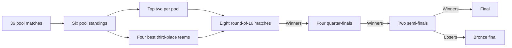

# Tournament dependencies

The 2027 tournament has 36 pool matches and 16 knockout matches. All pool results must be complete and consistent before qualification resolves. Third-place assignments use the official lookup for all 15 qualifying-pool combinations.

`src/domain/derive.ts` resolves teams from the versioned tournament definition and canonical scenario. Pool points, statistical tie-breaks and rankings determine qualification. Knockout advancement can be selected separately after a drawn score.

Changing a known matchup clears its incompatible prediction and downstream choices in one reversible action. Temporarily incomplete or conflicting earlier results leave bound picks dormant; correcting those results can restore the same matchup. Shared links include participant bindings and resolved outcomes.

The original 2023 dataset has four five-team pools, 40 pool fixtures and eight knockout fixtures beginning with quarter-finals. Its 48 match IDs remain distinct from the 2027 dataset. See [tournament sources](docs/tournament-sources.md) for versions and provisional rules.
